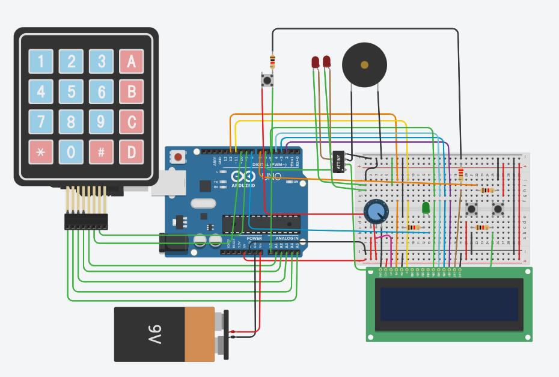
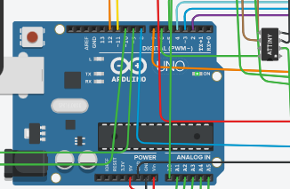
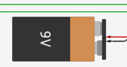
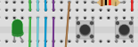
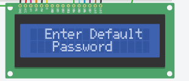
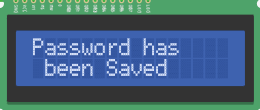

# ARDUINO-OFFICE-SECURITY-SYSTEM
 
Implementation of an office security system using Arduino Uno.

# Simulation in TinkerCad
# Modules:
### • Arduino uno  
 
### • Potentiometer   
### • LED-RED  
### • LED-GREEN  
### • Battery(9v)  
 
### • BUZZER  
### • ATtiny  
### • Buttons  
### • Keypad  
### • LCD 16x2  

## Explanation:

  1. When you want to enter the door first time, it asks for enter a new password as visa card by pushing right button

  
2. Green led  flashes as verification 
 

3.after entering password 3 consequtive times buzzer and red led will alert  
 

###### Another Version with more features which include photoresistor , laser and mirrors which can detect anything inside office like crashes from wall or window
 

 

